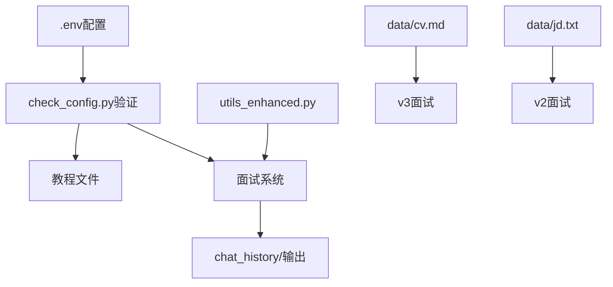

# 📁 项目文件说明

> 各文件功能和使用说明

## 🎯 核心文件

### 📚 教程文件（学习用）

| 文件名 | 用途 | 难度 | 时长 |
|--------|------|------|------|
| `Learn-Agent-Enhanced.ipynb` | 🌟 **Agent入门教程** | ⭐⭐ | 60分钟 |
| `Learn-Function-calling-Enhanced.ipynb` | Function Calling教程 | ⭐⭐⭐ | 30分钟 |
| `补充-路由链-Enhanced.ipynb` | 路由链教程 | ⭐⭐⭐ | 30分钟 |

**推荐学习顺序**: Agent入门 → Function Calling → 路由链

### 🎪 面试系统（实战用）

| 文件名 | 面试模式 | 特点 | 适合场景 |
|--------|----------|------|----------|
| `v1-Create-Custom-Agent-Enhanced.ipynb` | **基础面试** | 通用技术问题 | 技能练习 |
| `v2-Create-Custom-Agent-Enhanced.ipynb` | **JD面试** | 解析职位要求 | 目标职位准备 |
| `v3-Create-Custom-Agent-Enhanced.ipynb` | **CV面试** | 基于个人简历 | 个性化面试 |

**推荐使用顺序**: v1基础 → v2定向 → v3个性化

## 🔧 工具文件

### Python文件
```
utils_enhanced.py          # 工具函数库
├── save_chat_history()    # 聊天记录保存
├── parse_jd_to_json()     # JD解析
├── parse_cv_to_md()       # CV解析  
└── create_llm_for_parsing() # LLM创建

check_config.py            # 🔍 配置验证脚本
├── check_deepseek_config() # DeepSeek配置检查
├── check_bge_model()       # BGE模型检查
├── check_qdrant_config()   # Qdrant配置检查
└── test_deepseek_api()     # API测试
```

### 配置文件
```
.env.example.enhanced      # 环境变量模板
├── DEEPSEEK_API_KEY      # DeepSeek API密钥
├── BGE_MODEL_PATH        # BGE模型路径
├── QDRANT_HOST/PORT      # Qdrant配置
└── HTTP_PROXY            # 代理配置

requirements.txt           # Python依赖包
└── 包含所有必要依赖包的清单
```

## 📊 数据目录

### data/ 文件夹
```
data/
├── cv.md                  # 简历Markdown格式
├── cv.txt                 # 简历文本格式  
├── jd.json               # 职位描述JSON格式
└── jd.txt                # 职位描述文本格式
```

**用法**:
- 将你的简历内容放入 `cv.md` 或 `cv.txt`
- 将目标职位JD放入 `jd.txt`
- v2和v3模式会自动读取这些文件

### chat_history/ 文件夹
```
chat_history/
├── {timestamp}/          # 每次面试的独立文件夹
│   ├── chat_history.txt  # 对话记录
│   └── 面试报告.md       # 面试反馈报告
└── temp/                 # 临时文件夹
    └── chat_history.txt  # 当前对话临时保存
```

**自动生成**:
- 每次面试开始时创建时间戳文件夹
- 面试结束时生成完整的评估报告

## 📖 文档文件

### 说明文档
```
README.md                  # 📘 完整项目说明
├── 项目概述和特性
├── 技术架构说明
├── 详细使用指南
└── 常见问题解答

QUICKSTART.md             # ⚡ 5分钟快速入门
├── 核心配置步骤
├── 立即体验指南  
└── 使用技巧

PROJECT_STRUCTURE.md      # 📁 本文件
└── 各文件功能说明

DEPLOYMENT_GUIDE.md       # 🚀 部署指南
└── 生产环境部署说明
```

## 🎯 使用建议

### 🌟 新手推荐路径
```
1. 阅读 QUICKSTART.md (5分钟)
2. 配置 .env 文件 (2分钟)
3. 运行 check_config.py 验证 (1分钟)
4. 学习 Learn-Agent-Enhanced.ipynb (60分钟)
5. 体验 v1-Create-Custom-Agent-Enhanced.ipynb (30分钟)
```

### 🏆 进阶使用路径
```
1. 完成新手路径
2. 准备个人简历和目标JD
3. 体验 v2 和 v3 面试模式
4. 学习 Function Calling 和路由链
5. 自定义面试问题和评估标准
```

### 🔧 开发定制路径  
```
1. 理解 utils_enhanced.py 工具函数
2. 修改 system_prompt 调整面试风格
3. 扩展工具函数添加新功能
4. 集成其他向量数据库或模型
5. 开发Web界面或API服务
```

## 💡 文件选择指南

### 我该用哪个文件？

**🎓 想学习Agent开发**
→ `Learn-Agent-Enhanced.ipynb`

**💼 想练习基础面试**  
→ `v1-Create-Custom-Agent-Enhanced.ipynb`

**🎯 想针对特定职位准备**
→ `v2-Create-Custom-Agent-Enhanced.ipynb`

**📝 想基于简历深度面试**
→ `v3-Create-Custom-Agent-Enhanced.ipynb`

**🔍 遇到配置问题**
→ `check_config.py`

**📖 需要详细说明**  
→ `README.md`

**⚡ 想快速上手**
→ `QUICKSTART.md`

## 🔄 文件依赖关系



---

🎯 **根据你的需求选择合适的文件开始使用！** 

*建议先运行 `check_config.py` 确保环境配置正确*
