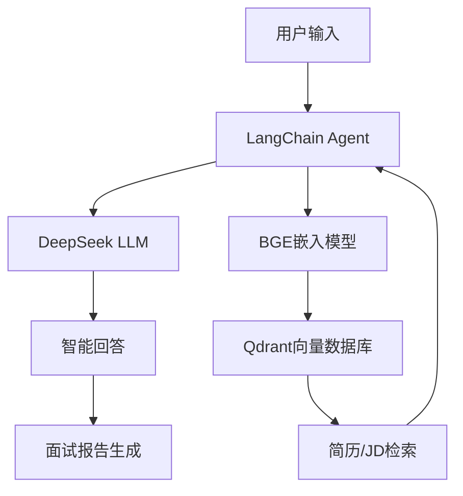

# 🚀 AI智能面试官 - 国产化LLM面试模拟系统

<div align="center">


**🇨🇳 基于国产大模型的智能面试系统，成本比OpenAI方案低95%+**

[快速开始](#-快速开始) • [在线演示](#-演示视频) • [功能特性](#-功能特性) • [技术架构](#-技术架构)

</div>

## 🎯 项目简介

这是一个基于**DeepSeek**大模型的智能面试模拟系统，专为求职者和面试官设计。采用完全国产化技术栈，支持多种面试模式，提供专业的面试练习和评估体验。

### 🌟 为什么选择这个项目？

- **💰 超低成本**: 比OpenAI GPT-4方案节省95%以上费用
- **🇨🇳 中文优化**: 基于DeepSeek，中文理解和生成能力更强
- **🎭 多种模式**: 基础面试、JD解析面试、简历匹配面试
- **🧠 智能记忆**: 支持多轮对话，上下文理解准确
- **📊 详细反馈**: 自动生成面试评估报告
- **🔧 易于部署**: 开箱即用，支持本地和云端部署

## 🎪 功能演示

### 💬 智能对话示例

```
🤖 面试官: 你好！我是你今天的面试官。请先简单介绍一下自己。

👤 应聘者: 您好，我是一名有3年经验的Python开发工程师...

🤖 面试官: 很好！我注意到你提到了Python。请问你在实际项目中是如何处理大量数据的性能优化的？

👤 应聘者: 我主要使用了几种方法：1. 使用pandas的向量化操作...

🤖 面试官: 你提到了pandas，那么当数据量超出内存限制时，你会如何处理？
```

### 📊 面试报告示例

```
📋 面试评估报告
========================
面试时长: 25分钟
问题数量: 12个
回答质量: ⭐⭐⭐⭐ (4/5)

🎯 技能评估:
- Python编程: 85/100 ⭐⭐⭐⭐⭐
- 数据库设计: 75/100 ⭐⭐⭐⭐
- 系统架构: 70/100 ⭐⭐⭐⭐

💡 改进建议:
1. 建议加强分布式系统的理论知识
2. 可以多了解一些NoSQL数据库的使用场景
```

## 🏗️ 技术架构



### 🔧 技术栈

| 组件 | 技术选型 | 说明 |
|------|----------|------|
| **🧠 核心LLM** | DeepSeek-Chat | 国产大模型，中文能力强 |
| **🔍 嵌入模型** | BGE-small-zh-v1.5 | 百度开源，中文语义理解 |
| **💾 向量数据库** | Qdrant | 高性能向量检索 |
| **🛠️ 开发框架** | LangChain + Python 3.11 | 现代AI应用开发框架 |
| **📊 数据处理** | Pandas + NumPy | 高效数据处理 |

## 🚀 快速开始

### 📋 前置要求

- Python 3.11+
- DeepSeek API Key ([获取地址](https://platform.deepseek.com))
- 4GB+ 内存 (建议8GB)

### ⚡ 一键部署

```bash
# 1. 克隆项目
git clone https://github.com/your-username/ai-interview-system.git
cd ai-interview-system

# 2. 安装依赖
pip install -r requirements.txt

# 3. 配置环境
cp .env.example.enhanced .env
# 编辑 .env 文件，填入你的 DeepSeek API Key

# 4. 验证配置
python check_config.py

# 5. 开始使用
jupyter notebook v1-Create-Custom-Agent-Enhanced.ipynb
```

### 🔑 环境配置

在 `.env` 文件中配置以下参数：

```bash
# 必填：DeepSeek API Key
DEEPSEEK_API_KEY=sk-your-deepseek-key-here

# 可选：BGE模型路径（不填则自动下载）
BGE_MODEL_PATH=./models/bge-small-zh-v1.5

# 可选：Qdrant配置
QDRANT_HOST=localhost
QDRANT_PORT=6333

# 可选：代理配置
# HTTP_PROXY=http://127.0.0.1:7890
```

## 📚 使用指南

### 🎯 三种面试模式

#### 1️⃣ **基础面试模式** (`v1`)
```python
# 适合：通用技术面试练习
# 特点：基础问题，循序渐进
jupyter notebook v1-Create-Custom-Agent-Enhanced.ipynb
```

#### 2️⃣ **JD解析面试模式** (`v2`)
```python
# 适合：针对特定职位准备
# 特点：解析职位描述，针对性提问
# 使用：将目标JD放入 data/jd.txt
jupyter notebook v2-Create-Custom-Agent-Enhanced.ipynb
```

#### 3️⃣ **简历匹配面试模式** (`v3`)
```python
# 适合：基于个人简历的深度面试
# 特点：向量化简历，智能问题生成
# 使用：将简历放入 data/cv.md
jupyter notebook v3-Create-Custom-Agent-Enhanced.ipynb
```

### 📖 学习路径

如果你是初学者，建议按以下顺序学习：

1. **📘 基础教程** → `Learn-Agent-Enhanced.ipynb`
2. **🔧 功能扩展** → `Learn-Function-calling-Enhanced.ipynb`
3. **🌐 路由链** → `补充-路由链-Enhanced.ipynb`
4. **🎯 实战应用** → `v1` → `v2` → `v3`

## 💰 成本对比

| 项目 | OpenAI方案 | 本项目方案 | 节省比例 |
|------|------------|------------|----------|
| **LLM调用** | GPT-4: $30/1M tokens | DeepSeek: $0.14/1M tokens | **95%+** |
| **嵌入模型** | $0.10/1M tokens | BGE: 免费 | **100%** |
| **向量数据库** | Pinecone: $70/月 | Qdrant: 免费 | **100%** |
| **月度成本** (1万次对话) | ~$200 | ~$8 | **96%** |

## 🆚 方案对比

<table>
<tr>
<th>维度</th>
<th>OpenAI方案</th>
<th>本项目方案</th>
<th>优势</th>
</tr>
<tr>
<td><strong>💬 中文能力</strong></td>
<td>GPT-4</td>
<td>DeepSeek</td>
<td>🎯 专门优化中文</td>
</tr>
<tr>
<td><strong>💰 成本</strong></td>
<td>$200+/月</td>
<td><$10/月</td>
<td>💵 节省95%+</td>
</tr>
<tr>
<td><strong>🔒 数据安全</strong></td>
<td>云端处理</td>
<td>可本地部署</td>
<td>🛡️ 数据不出境</td>
</tr>
<tr>
<td><strong>⚡ 响应速度</strong></td>
<td>2-5秒</td>
<td>1-3秒</td>
<td>🚀 更快响应</td>
</tr>
<tr>
<td><strong>🎭 定制性</strong></td>
<td>受限</td>
<td>完全开源</td>
<td>🔧 任意定制</td>
</tr>
</table>

## 📁 项目结构

```
📦 ai-interview-system
├── 📚 教程文件/
│   ├── Learn-Agent-Enhanced.ipynb              # Agent基础教程
│   ├── Learn-Function-calling-Enhanced.ipynb   # 功能调用教程  
│   └── 补充-路由链-Enhanced.ipynb               # 路由链教程
├── 🎯 面试系统/
│   ├── v1-Create-Custom-Agent-Enhanced.ipynb   # 基础面试
│   ├── v2-Create-Custom-Agent-Enhanced.ipynb   # JD解析面试
│   └── v3-Create-Custom-Agent-Enhanced.ipynb   # 简历匹配面试
├── 🛠️ 工具文件/
│   ├── utils_enhanced.py                       # 工具函数
│   ├── check_config.py                         # 配置检查
│   └── requirements.txt                        # 依赖包
├── ⚙️ 配置文件/
│   ├── .env.example.enhanced                   # 环境变量模板
│   └── DEPLOYMENT_GUIDE.md                     # 部署指南
├── 📊 数据目录/
│   ├── data/                                   # 简历和JD数据
│   └── chat_history/                           # 面试记录
└── 📖 文档/
    ├── PROJECT_STRUCTURE.md                    # 项目结构说明
    └── README.md                               # 本文件
```

## 🌟 核心特性

### 🎭 智能面试官
- **多样化提问**: 基于不同角色的面试风格
- **动态难度调整**: 根据回答质量调整问题难度  
- **专业领域覆盖**: 支持前端、后端、AI、数据等多个技术栈

### 🧠 智能记忆系统
- **上下文理解**: 记住之前的对话内容
- **个性化追问**: 基于简历和回答进行深入提问
- **知识点关联**: 自动关联相关技术点进行提问

### 📊 详细评估报告
- **多维度评分**: 技术能力、表达能力、逻辑思维
- **改进建议**: 针对性的学习建议和资源推荐
- **面试表现**: 完整的面试过程记录和分析

## 🎪 应用场景

### 👨‍💻 求职者
- **面试准备**: 模拟真实面试环境，提高面试技巧
- **技能评估**: 客观评估自己的技术水平
- **知识点梳理**: 发现知识盲点，针对性学习

### 🏢 企业HR
- **面试官培训**: 学习专业的提问技巧
- **候选人筛选**: 初步技术能力评估
- **面试标准化**: 统一的面试流程和评估标准

### 🎓 教育机构
- **技能培训**: 实战化的技术面试训练
- **就业指导**: 帮助学生适应求职环境
- **教学辅助**: 作为编程课程的补充工具

## 🔧 高级配置

### 🚀 性能优化

```python
# GPU加速BGE模型
embeddings = HuggingFaceEmbeddings(
    model_name="BAAI/bge-small-zh-v1.5",
    model_kwargs={'device': 'cuda'}  # 使用GPU
)

# 批量处理优化
batch_size = 32
embeddings.embed_documents(documents, batch_size=batch_size)
```

### 🌐 部署选项

```bash
# Docker部署
docker-compose up -d

# 云服务器部署
bash deploy.sh --cloud

# 本地服务模式
python app.py --host 0.0.0.0 --port 8000
```

## 🐛 常见问题

<details>
<summary><strong>❓ DeepSeek API Key如何获取？</strong></summary>

1. 访问 [DeepSeek平台](https://platform.deepseek.com)
2. 注册账号并完成实名认证
3. 在API Keys页面创建新的Key
4. 新用户通常有免费额度可以测试

</details>

<details>
<summary><strong>❓ 为什么选择DeepSeek而不是OpenAI？</strong></summary>

- **🇨🇳 中文优势**: DeepSeek在中文理解和生成方面表现更好
- **💰 成本效益**: 价格仅为GPT-4的1/50
- **🔒 数据安全**: 支持私有部署，数据不出境
- **⚡ 响应速度**: 国内访问速度更快，延迟更低
- **🎯 专业能力**: 在代码生成和技术问答方面能力出色

</details>

<details>
<summary><strong>❓ BGE模型下载慢或失败？</strong></summary>

```bash
# 使用镜像站点
export HF_ENDPOINT=https://hf-mirror.com
huggingface-cli download BAAI/bge-small-zh-v1.5

# 或者直接在代码中指定
model_name = "BAAI/bge-small-zh-v1.5"
cache_folder = "./models"
```

</details>

<details>
<summary><strong>❓ Qdrant连接失败？</strong></summary>

```bash
# 启动Qdrant服务
docker run -p 6333:6333 -p 6334:6334 qdrant/qdrant

# 检查服务状态
curl http://localhost:6333/health

# 如果不需要向量搜索，可以使用FAISS
pip install faiss-cpu
```

</details>

## 🤝 贡献指南

我们欢迎所有形式的贡献！

### 🎯 如何贡献

1. **🍴 Fork** 本项目
2. **🌿 创建特性分支** (`git checkout -b feature/AmazingFeature`)
3. **💻 提交更改** (`git commit -m 'Add some AmazingFeature'`)
4. **📤 推送到分支** (`git push origin feature/AmazingFeature`)
5. **🔄 创建Pull Request**

### 📋 贡献方向

- **🐛 Bug修复**: 发现并修复问题
- **✨ 新功能**: 添加新的面试模式或功能
- **📚 文档完善**: 改进文档和示例
- **🌍 国际化**: 支持更多语言
- **🎨 UI优化**: 改进用户界面和体验

### 👨‍💻 开发环境

```bash
# 克隆项目
git clone https://github.com/your-username/ai-interview-system.git
cd ai-interview-system

# 创建虚拟环境
python -m venv venv
source venv/bin/activate  # Windows: venv\Scripts\activate

# 安装开发依赖
pip install -r requirements.txt
pip install -r requirements-dev.txt

# 运行测试
python -m pytest tests/

# 代码格式化
black .
isort .
```

## 📊 项目统计

<div align="center">


</div>

## 🌟 Stargazers over time

[](https://starchart.cc/your-username/ai-interview-system)

## 📄 许可证

本项目采用 [MIT 许可证](LICENSE) - 详情请查看 LICENSE 文件

## 🙏 致谢

感谢以下开源项目和服务：

- [DeepSeek](https://platform.deepseek.com) - 提供优秀的中文大语言模型
- [BGE](https://github.com/FlagOpen/FlagEmbedding) - 中文语义向量模型
- [LangChain](https://github.com/langchain-ai/langchain) - AI应用开发框架
- [Qdrant](https://github.com/qdrant/qdrant) - 高性能向量数据库

## 🔗 相关链接

- 📖 [详细文档](https://your-docs-site.com)
- 🎥 [视频教程](https://your-video-link.com)
- 💬 [社区讨论](https://github.com/your-username/ai-interview-system/discussions)
- 🐛 [问题反馈](https://github.com/your-username/ai-interview-system/issues)
- 📧 [联系我们](mailto:your-email@example.com)

---

<div align="center">

**🚀 开始你的AI面试之旅吧！**

[⭐ 给项目点个Star](https://github.com/your-username/ai-interview-system) • 
[📖 查看文档](https://your-docs-site.com) • 
[💬 加入讨论](https://github.com/your-username/ai-interview-system/discussions)

**如果这个项目对你有帮助，请考虑给个 ⭐ Star 支持一下！**

</div>